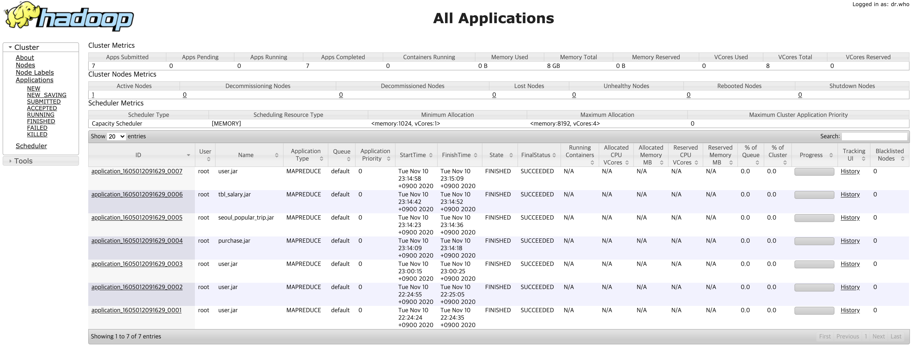
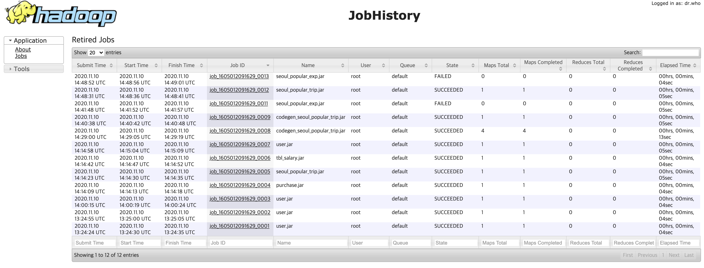

# 데이터 엔지니어링 초급 2일차
> 데이터 처리 및 분석의 가장 처음 과정인 데이터 수집 도구를 이용한 데이터 적재를 실습합니다.
> 관계형 데이터베이스 수집을 위한 Apache Sqoop, 파일 데이터 수집을 위한 TreasureData Fluentd 를 이용해 실습합니다

- 목차
  * [1. Apache Sqoop Table Import](#1-Apache-Sqoop-Table-Import)
  * [2. Apache Sqoop Table Export](#2-Apache-Sqoop-Table-Export)
  * [3. TreasureData Fluentd File Collect](#3-TreasureData-Fluentd-File-Collect)


## 1. Apache Sqoop Table Import
* 대상 서버에 접속하기 위해 도커 컴포즈를 이용하여 서버를 기동합니다
```bash
bash> cd ~/workspace/data-engineer-basic-training/day2
bash> docker-compose up -d
bash> docker-comopse ps
```

### 1.1 데이터베이스, 테이블 이름 조회
* sqoop 서버에 접속하여 list-databases, list-tables, eval 명령어를 이용하여 조회합니다
```bash
bash> docker-compose exec sqoop bash

$> sqoop list-databases --connect jdbc:mysql://mysql:3306 --username sqoop --password sqoop
$> sqoop list-tables --connect jdbc:mysql://mysql:3306/testdb --username sqoop --password sqoop

$> sqoop eval --connect jdbc:mysql://mysql:3306/testdb --username sqoop --password sqoop -e "describe user"
$> sqoop eval --connect jdbc:mysql://mysql:3306/testdb --username sqoop --password sqoop -e "select * from user"
$> sqoop eval --connect jdbc:mysql://mysql:3306/testdb --username sqoop --password sqoop -e "select * from purchse"
```

### 1.2 테이블 조인, DDL, DML 명령어 수행
* eval 명령어를 이용하면 Join, Create, Insert, Select 등 DDL, DML 명령을 수행할 수 있습니다
  - 실제 테이블 수집 시에도 다수의 테이블 대신 Join 한 결과를 사용하는 경우 효과적인 경우도 많습니다
```bash
$> sqoop eval --connect jdbc:mysql://mysql:3306/testdb --username sqoop --password sqoop \
    -e "select u.*, p.* from user u join purchase p on (u.u_id = p.p_uid) limit 10"

$> sqoop eval --connect jdbc:mysql://mysql:3306/testdb --username sqoop --password sqoop \
    -e "create table tbl_salary (id int not null auto_increment, name varchar(30), salary int, primary key (id))"

$> sqoop eval --connect jdbc:mysql://mysql:3306/testdb --username sqoop --password sqoop \
    -e "insert into tbl_salary (name, salary) values ('suhyuk', 10000)"

$> sqoop eval --connect jdbc:mysql://mysql:3306/testdb --username sqoop --password sqoop \
    -e "select * from tbl_salary"

$> sqoop eval --connect jdbc:mysql://mysql:3306 --username sqoop --password sqoop \
    -e "show databases"

$> sqoop eval --connect jdbc:mysql://mysql:3306/testdb --username sqoop --password sqoop \
    -e "show tables"

```

### 1.3 로컬 모드 테이블 수집
* **"로컬 모드"** 란? 분산 저장/처리 엔진을 이용하지 않고 실행되는 장비의 리소스만을 이용하여 로컬 디스크에 저장할 수 있는 모드입니다
  - "-fs local" 옵션 : File System 이 local 모드임을 의미 (로컬 저장소에 저장)
  - "-jt local" 옵션 : Job Tracker 가 local 모드임을 의미 (로컬 리소스를 사용)
  - "--as-parquetfile" 옵션 : 텍스트 파일 대신, 스키마를 포함한 색인이 포함된 압축 파일 포맷 (바이너리 포맷)
```bash
$> sqoop import \
    -fs local \
    -jt local \
    -m 1 \
    --connect jdbc:mysql://mysql:3306/testdb \
    --table user \
    --target-dir file:///tmp/target/user/20201025 \
    --username sqoop \
    --password sqoop \
    --relaxed-isolation \
    --as-parquetfile \
    --delete-target-dir

$> sqoop import -jt local -m 1 --connect jdbc:mysql://mysql:3306/testdb --table purchase \
    --target-dir file:///tmp/target/purchase/20201025 --username sqoop --password sqoop \
    --relaxed-isolation --as-parquetfile --delete-target-dir

$> ls /tmp/target/*/20201025/*.parquet
```

### 1.4 파케이 포맷 파일 읽기
* 파케이 포맷으로 저장된 테이블을 수집하고 출력합니다 
  - 파케이 포맷의 파일은 바이너리 포맷이라 cat 혹은 vi 등으로 내용을 확인할 수 없습니다
  - 서버에 설치된 /jdbc/parquet-tools-1.8.1.jar 어플리케이션을 이용하여 확인이 가능합니다
```bash
$> sqoop import -jt local -m 1 --connect jdbc:mysql://mysql:3306/testdb --table seoul_popular_trip \
    --target-dir file:///tmp/target/seoul_popular_trip --username sqoop --password sqoop \
    --relaxed-isolation --as-parquetfile --delete-target-dir

$> hadoop jar /jdbc/parquet-tools-1.8.1.jar head file:///tmp/target/seoul_popular_trip
```

* 파케이 포맷 도구를 이용하여 사용가능한 기능
  - head -n 5 : 상위 5개의 문서를 출력합니다 (default: 5)
  - cat : 문서를 그대로 출력합니다
  - schema : 테이블 스키마를 출력합니다
  - meta : 파케이 포맷의 메타데이터를 출력합니다 
  - dump : 텍스트 포맷으로 출력 합니다
```bash
$> hadoop jar /jdbc/parquet-tools-1.8.1.jar head -n 10 file:///tmp/target/seoul_popular_trip

$> hadoop jar /jdbc/parquet-tools-1.8.1.jar schema file:///tmp/target/seoul_popular_trip

$> hadoop jar /jdbc/parquet-tools-1.8.1.jar meta file:///tmp/target/seoul_popular_trip
```

### 1.5 클러스터 모드에서 테이블 수집
* **"클러스터 모드"** 란? 분산 저장/처리 엔진을 활용하여 원격지 장비의 리소스를 활용하여 원격 디스크에 저장할 수 있는 모드입니다
  - "-fs namenode:port" 옵션 : File System 이 분산 파일시스템 의미 (Ex. HDFS)
  - "-jt jobtracker:port" 옵션 : Job Tracker 가 분산 처리시스템 의미 (Ex. YARN)
  - 본 예제에서는 관련 설정이 되어 있으므로 -fs, -jt 옵션을 지정하지 않아도 됩니다
  - 저장경로의 경우에도 hdfs:// 는 명시하지 않아도 hdfs 에 저장됩니다
```bash
$> sqoop import -m 1 --connect jdbc:mysql://mysql:3306/testdb --table user \
    --target-dir /user/sqoop/user_append --username sqoop --password sqoop \
    --fields-terminated-by '\t' --relaxed-isolation --delete-target-dir

$> hadoop fs -cat /user/sqoop/user_append/part-m-00000
```

### 1.6 기본 하둡 명령어 실습
* 하둡 분산 저장시스템에 존재하는 파일을 읽고, 쓰기 위해서는 hadoop 명령어를 이용해야 합니다
  - hadoop fs -cat <uri> : 경로의 파일을 읽습니다
  - hadoop fs -ls <uri> : 경로의 목록을 출력합니다
  - hadoop fs -mkdir -p <uri> : 경로를 하위 경로(p)까지 생성(mkdir)합니다
  - hadoop fs -cp <from> <to> : 경로의 파일을 복사합니다
  - hadoop fs -mv <from> <to> : 경로의 파일을 이동합니다
```bash
$> hadoop fs -ls /user/sqoop/user_append/part-m-00000
$> hadoop fs -mkdir /user/sqoop/foo/bar
$> hadoop fs -cp /user/sqoop/user_append/part-m-00000 /user/sqoop/foo/bar
$> hadoop fs -cat /user/sqoop/foo/bar/part-m-00000
```

### 1.7 조건문을 통한 테이블 수집
* "--table" 옵션과 더불어 "--where" 옵션을 통해 부분 수집이 가능합니다
  - 사전에 eval 명령으로 데이터 값의 범위를 파악할 수 있습니다
  - 부분수집 결과를 바로 확인하기 위해 user\_append 경로에 텍스트 파일로 저장합니다
```bash
$> sqoop eval --connect jdbc:mysql://mysql:3306/testdb --username sqoop --password sqoop \
    -e "select min(u_id), max(u_id) from user"

$> sqoop import -m 1 --connect jdbc:mysql://mysql:3306/testdb --table user \
    --where "u_id < 5" \
    --target-dir /user/sqoop/user_append --username sqoop --password sqoop \
    --fields-terminated-by '\t' --relaxed-isolation --delete-target-dir

$> hadoop fs -cat /user/sqoop/user_append/part-m-00000

```

### 1.8 덮어쓰지 않고 추가하기
* 기본은 Overwrite 모드인데, --append 옵션을 주는 경우 원본 파일은 그대로 두고 파티션 파일이 추가됩니다
  - "--append" 모드는 중복 데이터 적재 가능성이 있으므로 주의해서 사용해만 합니다
  - "--append" 모드는 파일시스템이 HDFS 인 경우에만 지원합니다
```bash
$> sqoop import -m 1 --connect jdbc:mysql://mysql:3306/testdb --table user \
    --where "u_id >= 5" \
    --target-dir /user/soqop/user_append --username sqoop --password sqoop \
    --fields-terminated-by '\t' --relaxed-isolation --append

$> hadoop fs -cat /user/sqoop/user_append/part-m-00001
```

### 1.9 데이터베이스의 모든 테이블을 일괄 수집
* 테이블 단위로 수집을 위해서 최사위 경로 지정이 되어야 하며, primary-key 가 필요합니다
  - primary-key 가 존재해야 mapper 수를 자동으로 조정할 수 있기 때문이며, 없다면 오류가 발생합니다
  - 단, --autoreset-to-one-mapper 옵션이 있다면 primary-key 가 없어도 mapper 1개로 수집이 가능합니다
```bash
$> sqoop import-all-tables --connect jdbc:mysql://mysql:3306/testdb --warehouse-dir /user/sqoop/testdb \
    --fields-terminated-by '\t' --username sqoop --password sqoop --autoreset-to-one-mapper
```

### 1.10 수집된 하둡 파일 시스템을 웹브라우저에서 확인
* 하둡 네임노드에서 제공하는 관리도구가 50070 포트에 존재하지만, 본 실습에서는 포트 충돌을 피하기 위해 60070 포트에 띄웠습니다
  - [http://localhost:60070/explorer.html](http://localhost:60070/explorer.html#/) 에 접속하여 /user/sqoop/testdb 경로를 확인합니다


* 하둡 리소스 매니저에서 제공하는 관리도구가 8088 포트에 존재합니다
  - [http://localhost:8088/cluster](http://localhost:8088/cluster) 에 접속하여 수행되었던 작업 목록 및 상세 내역을 확인할 수 있습니다


* 하둡 히스토리 서버를 통해서 지난 작업에 대한 로그를 볼 수 있는 관리도구가 19888 포트에 존재합니다
  - [http://localhost:19888/jobhistory](http://localhost:19888/jobhistory) 에 접속하여 수행되었던 작업 목록 및 상세 내역을 확인할 수 있습니다



### 1.11 하나의 테이블을 병렬로 수행하여 성능을 향상
* 여태까지는 하나의 테이블에 하나의 작업으로만 수행했으나, 대용량 테이블의 경우 구간을 나누어 여러개의 수집을 병렬로 수행할 수 있습니다
  - "-m 4" : 한 번에 4개의 작업이 하나의 테이블을 수집할 수 있습니다. 단, 어떤 컬럼을 기준으로 나누는지 설정이 필요합니다
  - "--split-by id" : 해당 컬럼을 기준으로 min, max 값을 계산하고 4개의 파티션 범위를 정하여 수집합니다 (skewness 해결은 어렵습니다)
```bash
$> sqoop import -m 4 --split-by id --connect jdbc:mysql://mysql:3306/testdb --table seoul_popular_trip \
    --target-dir /user/sqoop/seoul_popular_trip/split_by --username sqoop --password sqoop \
    --relaxed-isolation --as-parquetfile --delete-target-dir

$> hadoop fs -ls /user/sqoop/seoul_popular_trip/split_by
```


## 2. Apache Sqoop Table Export

### 2.1 테이블 익스포트를 위한 테이블 생성 및 수집
* seoul\_popular\_exp 라는 테이블을 동일한 스키마로 생성합니다
* seoul\_popular\_trip 테이블을 seoul\_popular\_exp 라는 경로에 수집합니다
  - 단, HCatalog 를 사용하지 않는한 현재 버전의 Sqoop Export 는 Parquet 포맷을 지원하지 않습니다
```bash
$> sqoop eval --connect jdbc:mysql://mysql:3306/testdb --username sqoop --password sqoop \
    -e "create table seoul_popular_exp (category int not null, id int not null, name varchar(100), address varchar(100), naddress varchar(100), tel varchar(20), tag varchar(500)) character set utf8 collate utf8_general_ci;"

$> sqoop list-tables --connect jdbc:mysql://mysql:3306/testdb --username sqoop --password sqoop

$> sqoop import -m 1 --connect jdbc:mysql://mysql:3306/testdb --table seoul_popular_trip \
    --target-dir /user/sqoop/seoul_popular_exp --username sqoop --password sqoop \
    --fields-terminated-by '\t' --relaxed-isolation --delete-target-dir
```

### 2.2 테이블 익스포트 수행
* 적재된 데이터를 익스포트 명령을 통해서 수행하였으나 실패하였고, 원인을 파악해 봅니다 
* [Hadoop History Server](http://localhost:19888/jobhistory) 에 접속하여 원인을 파악합니다
  - 실제 로그를 살펴보면 한 줄 전체를 문자열로 인식하고 넣으려다가 발생한 오류를 알게 됩니다
```bash
$> sqoop export -m 1 --connect jdbc:mysql://mysql:3306/testdb --table seoul_popular_exp \
    --export-dir /user/sqoop/seoul_popular_exp --username sqoop --password sqoop
```
* 익스포트 시에도 데이터를 읽을 때의 구분자가 지정되지 않아서 발생한 오류입니다
  - 테이블 익스포트의 경우 항상 가비지 데이터가 존재할 수 있기 때문에 반드시 사전에 truncate 작업을 수행합니다
```bash
$> sqoop eval --connect jdbc:mysql://mysql:3306/testdb --username sqoop --password sqoop \
    -e "truncate table seoul_popular_exp"

$> sqoop export -m 1 --connect jdbc:mysql://mysql:3306/testdb --table seoul_popular_exp \
    --export-dir /user/sqoop/seoul_popular_exp --username sqoop --password sqoop \
    --fields-terminated-by '\t'

$> sqoop eval --connect jdbc:mysql://mysql:3306/testdb --username sqoop --password sqoop \
    -e "select count(1) from seoul_popular_exp"
```


## 3. TreasureData Fluentd File Collect

### 3.1

